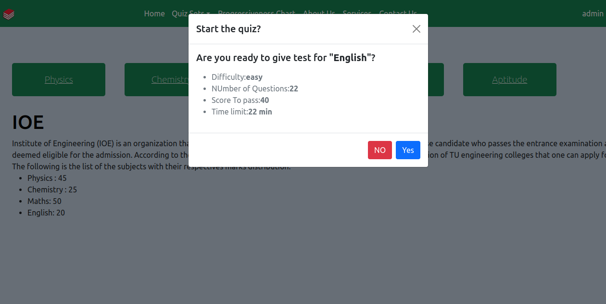
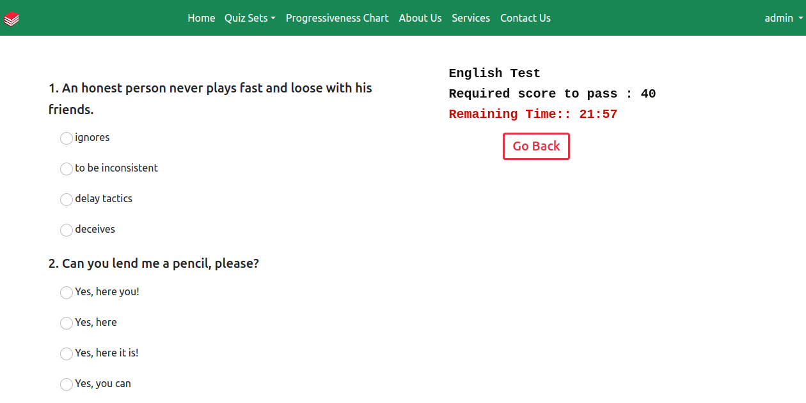
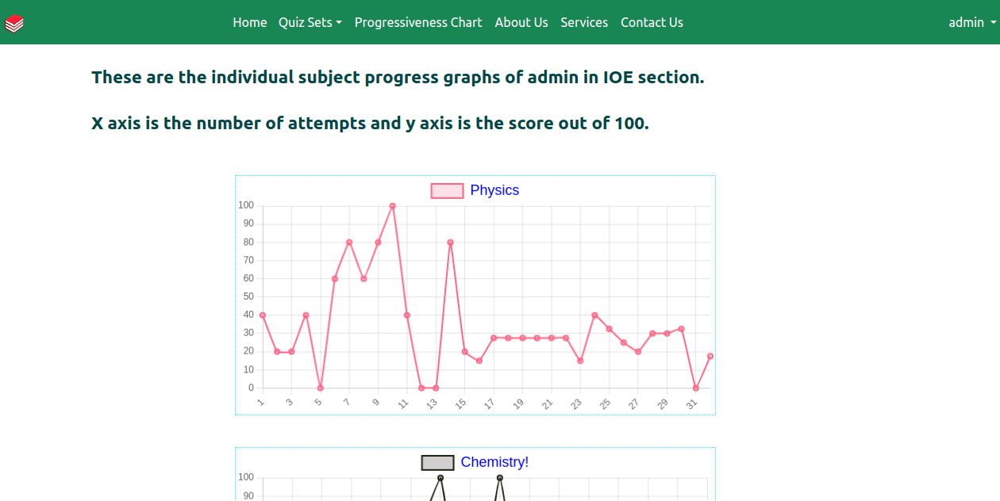

# Entrance Preparation App

This is an entrance preparation app that has quiz functionality where students can attempt different question sets on IOE and IOM fields.
They can track their progress by creating their own account and see their progress in charts too.

## Technology used:
Python, Django, Javascript, HTML, CSS

## Instructions for installation:
1. Make a python environment: `virtualenv myenv`
2. Activate the environment: `source myenv/bin/activate`
3. Install the requirements: `pip install -r requirements.txt`
4. Setup the pgadmin in your pc: [https://computingforgeeks.com/how-to-install-pgadmin-4-on-ubuntu/](https://computingforgeeks.com/how-to-install-pgadmin-4-on-ubuntu/)
5. Make a database and import the sql file.
6. Run the following commands:
    ```
    python manage.py makemigrations
    python manage.py migrate
    python manage.py runserver
    ```

## Demo screenshots!!

<br>
<br>
<br>
<br>


## Credit
This project was completed as a part of Minor project of the curriculum of third year of the department of Electronics and Computer Engineering in Pulchowk Campus.
